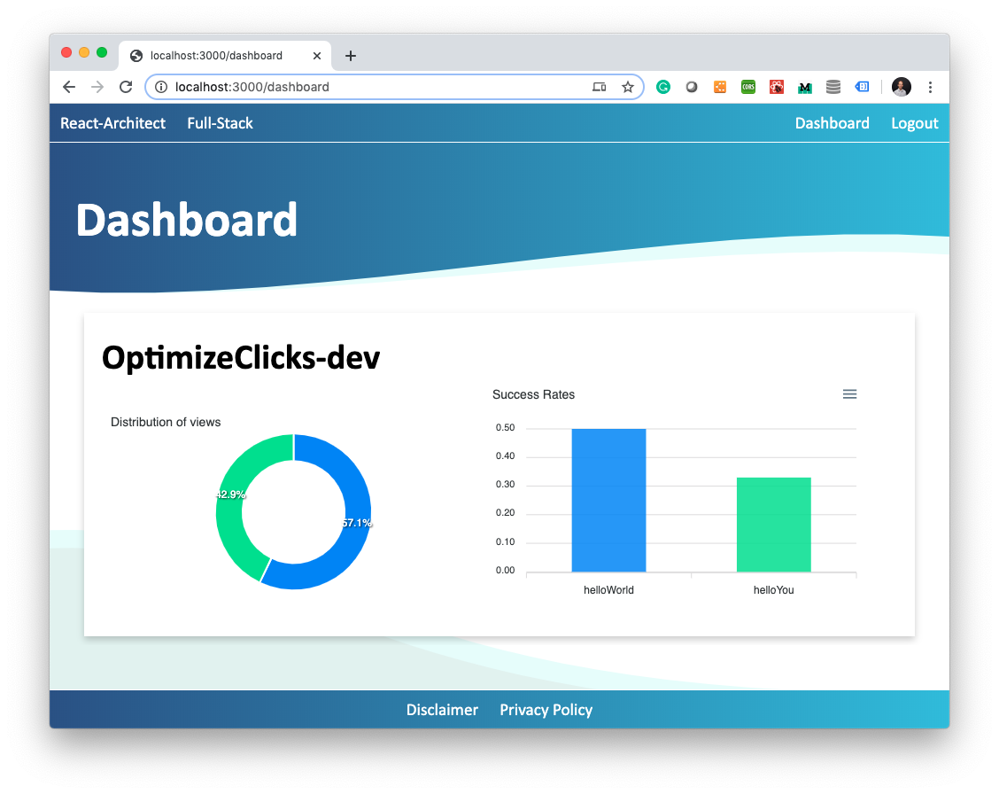

***************
Getting Started
***************

Install Library
================

You can install `react-recommender <https://github.com/react-architect/react-recommender>`_
easily:

    npm install --save react-recommender

Integrate React-Recommender
===========================

`react-recommender <https://github.com/react-architect/react-recommender>`_ provides a higher-order-component as the
default export. Integrate it at a high level in your app.:

    import Recommender from 'react-recommender';

    ReactDOM.render(
      <Recommender accountId="mail@react-architect.com">
        <MyApp/>
      </Recommender>,
      document.getElementById('root')
    );

The ``<Recommender/>``-component takes a single property: ``accountId``. You can use any arbitrary ``string`` here.
But if you want to see the statistics of how well your React app performs, you'll need to specify an email address.
It ensures that no one else gets access to it.

Define An Objective
===================

The most important aspect of a self-improving algorithm is an objective. The objective of your React app is up to you.
Typical objectives of web-apps are clicks on a button, subscriptions, or transactions. Whatever fits the purpose of your app.

While you can choose any arbitrary objective, it must be measurable by your app. Because your self-improving React
app will use the objective to assess its performance.

Let's say we want the users of our app to click on a certain button anywhere in our component hierarchy.

    import react from 'react';
    import { withObjective } from 'react-recommender';

    export const Objective = withObjective(
      ({onAchieved, ...props}) => <button onClick={(evt)=> onAchieved("OptimizeClicks")}>Click Me</button>
    );

We import the ``withObjective``-function from ``react-recommender``. It adds the ``onAchieved``-callback function to
the properties of the wrapped component. We separate the ``onAchieved``-property from the other properties by
using the Spread Syntax (``{onAchieved, ...props}``).

Calling the ``onAchieved``-function implies our app achieved an objective.
In our example, a click on the button lets our app achieve the objective ``OptimizeClicks``.

Define The Options
==================

In order for our app to improve itself to achieve the objective, it must have the ability to change. We have to provide
options to our React app. Options, the app can select one from when it renders. You can use the options to display
different content, like your app's headline. You can apply different styles, like the color of a button.
You can even use different options of your app's internal logic - if you like. You can use as an option whatever
you can put into a React component. And that is pretty much anything you can think of.

    import react from 'react';
    import { Recommend, Option } from 'react-recommender';

    export const SelectOption = (props) => (
      <Recommend
        mode="egreedy"
        epsilon={0.1}
        objectiveId="OptimizeClicks"
        options={[
          <Option id="helloWorld">
            
Hello World

          </Option>,
          <Option id="helloYou">
            
Hello You

          </Option>
        ]}>{
            ({loading, error, recommendation, renderOption}) => {
                return (loading && 
Loading
) ||
                    (recommendation ? renderOption(recommendation) : 
Error
)
            }
        }
      </Recommend>
    );

We provide two options. The first shows a ``
`` saying ``Hello World``. The second shows a ``
`` saying ``Hello You``.
We wrap each of the options into an ``<Option/>``-component. We provide the array of options as a property to a
``<Recommend/>``-component.

When your React app renders this ``<Recommend/>``-component, it checks which of the options promises to have the best
chance of achieving the specified objective (here: ``OptimizeClicks``).

We provide a function as the child of the ``<Recommend/>``-component. This function takes a few parameters:

- ``loading`` is a ``Boolean``-value. It indicates whether the app is currently loading the recommendation (``true``)
or whether it has finished (``false``).

- ``error`` may contain an error message if something went wrong while loading the best option.

- If there was no error and loading finished, ``recommendation`` contains the ``id`` of the recommended option.
You specify the ``id`` as the property of an ``<Option/>``-component.

- You can use the ``renderOption``-callback function to render the content of an option by specifying the
``<Option/>``'s ``id``. Usually, this is the ``id`` you get as the ``recommendation``. But you are free to overrule it.

This is all you need to build a self-improving React app.

Monitor The Improvements
========================

``react-recommender`` comes with a serverless backend. It counts how many times your app renders the options and
achieves the objective. You can have a look at the current state of your recommender
at `https://www.react-architect.com <https://www.react-architect.com/page?ref=docs&dest=/>`_.

